# Command Line Assistant (CLA) Architecture

This document provides a comprehensive overview of the Command Line Assistant codebase architecture.

## System Architecture Diagram

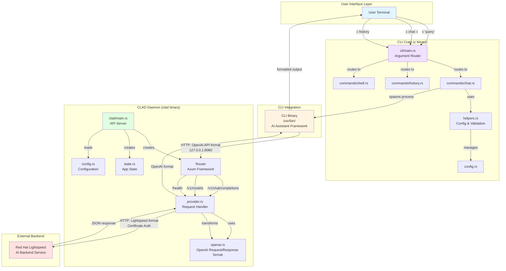

## Component Details

### 1. CLI Crate (`c` binary)

**Purpose**: User-facing command-line interface for quick AI assistance

**Key Components**:
- **main.rs**: Smart argument routing
  - Defaults to chat mode for natural language
  - Routes to specific subcommands (chat, history, shell)
  - Handles special cases like `-i` for interactive mode

- **commands/chat.rs**: Chat command implementation
  - Interactive mode: `c -i` → spawns `cli session`
  - Query mode: `c "question"` → spawns `cli run -t "question"`
  - Validates arguments and finds cli binary

- **commands/history.rs**: History management (stub)
  - View past conversations
  - List with filters and limits

- **commands/shell.rs**: Shell integration (stub)
  - Install/uninstall shell hooks
  - Shell-specific integrations (bash, zsh, fish)

- **helpers.rs**: Utility functions
  - Find cli binary (`/usr/bin/cli` or `$CLI_BINARY`)
  - Validate arguments (security checks)
  - Manage cli config files
  - Environment variable filtering

- **config.rs**: Configuration management
  - Manages cli configuration at `~/.config/cli/`
  - Creates `config.yaml` with CLAD endpoint

### 2. CLAD Daemon (`clad` binary)

**Purpose**: OpenAI-compatible API proxy to Red Hat Lightspeed backend

**Key Components**:
- **main.rs**: Axum web server
  - Listens on `127.0.0.1:8080` (fixed)
  - Creates authenticated HTTP client
  - Routes requests to handlers

- **provider.rs**: Request/response transformation
  - Transforms OpenAI chat format → Red Hat Lightspeed format
  - Transforms Lightspeed responses → OpenAI format
  - Handles streaming and non-streaming responses
  - Adds system context (OS info, machine ID)

- **openai.rs**: OpenAI API data structures
  - ChatCompletionRequest/Response
  - Message, Choice, Usage models
  - Streaming chunk models

- **config.rs**: Configuration loading
  - Backend endpoint URL
  - Certificate/key file paths for auth
  - Proxy settings (HTTP/HTTPS)
  - Logging level

- **state.rs**: Application state
  - Shared state across handlers
  - Config and HTTP client

### 3. CLI Integration

**Purpose**: AI assistant framework that connects to CLAD

**Role**:
- Manages conversation sessions
- Handles tool calling and extensions
- Formats output for terminal display
- Connects to CLAD via OpenAI-compatible API

**Configuration**: Created by CLI at `~/.config/cli/config.yaml`
```yaml
OLLAMA_HOST: 127.0.0.1:8080
CLI_MODEL: default-model
CLI_PROVIDER: ollama
```

### 4. External Backend

**Red Hat Lightspeed Backend**:
- AI inference service
- Requires certificate-based authentication
- Custom request/response format:
  - Request: `{"question": "...", "context": {...}}`
  - Response: `{"data": {"text": "..."}}`

## Data Flow

### Chat Query Flow

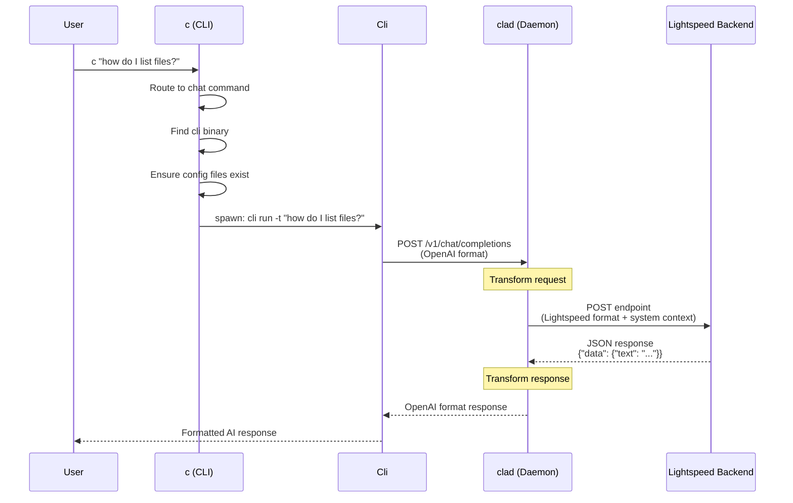

### Interactive Session Flow

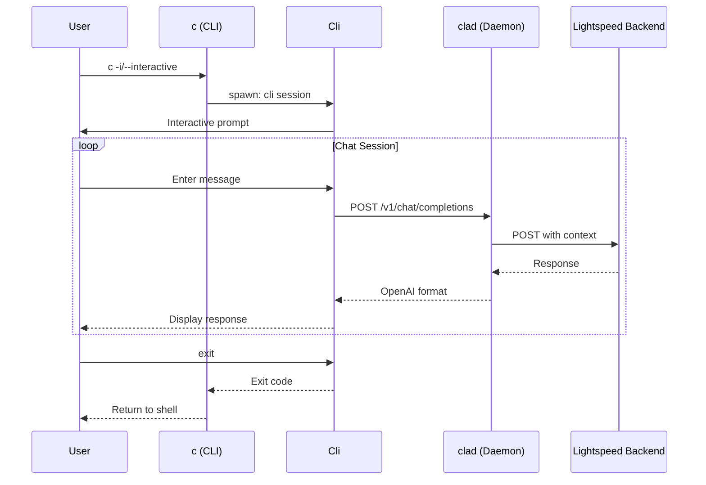

### Request Transformation

```mermaid
graph LR
    subgraph "OpenAI Format (Cli → CLAD)"
        OAI["{<br/>  messages: [{<br/>    role: 'user',<br/>    content: '...'<br/>  }],<br/>  model: 'default-model',<br/>  stream: false<br/>}"]
    end

    subgraph "CLAD Transformation"
        TRANSFORM[Extract last user message<br/>+ Add system context]
    end

    subgraph "Lightspeed Format (CLAD → Backend)"
        LS["{<br/>  question: '...',<br/>  context: {<br/>    systeminfo: {...},<br/>    terminal: {...},<br/>    cla: {version}<br/>  }<br/>}"]
    end

    OAI -->|provider.rs| TRANSFORM
    TRANSFORM -->|transform_request()| LS
```

## Configuration Files

### CLAD Configuration
**Location**: `/etc/xdg/command-line-assistant/config.toml` (or `$XDG_CONFIG_DIRS`)

```toml
[backend]
endpoint = "https://api.example.com/query"
timeout = 30

[backend.auth]
cert_file = "/etc/pki/consumer/cert.pem"
key_file = "/etc/pki/consumer/key.pem"

[backend.proxies]
http = "http://proxy:8080"
https = "https://proxy:8443"

[logging]
level = "INFO"
```

### Cli Configuration
**Location**: `~/.config/cli/config.yaml`

```yaml
OLLAMA_HOST: 127.0.0.1:8080
CLI_MODEL: default-model
CLI_PROVIDER: ollama
extensions:
  memory:
    enabled: true
    type: builtin
```

## Key Design Decisions

### 1. Smart CLI Routing
The `c` command intelligently routes arguments:
- `c "query"` → chat mode (default)
- `c -i` → interactive chat
- `c history` → history subcommand
- `c history from yesterday` → chat mode (natural language)
- `c history --list` → history subcommand (flag detected)

### 2. API Compatibility Layer
CLAD provides OpenAI-compatible API to:
- Work with existing AI tools (Cli)
- Abstract backend differences
- Enable easy switching between backends

### 3. Security Features
- Certificate-based authentication to backend
- Environment variable filtering
- Argument validation (length limits, null byte checks)
- Atomic file writes with locking

### 4. Streaming Support
CLAD simulates streaming by:
- Getting full response from backend
- Breaking into word-level chunks
- Sending as SSE events to client

### 5. Context Enrichment
Every request includes:
- OS information
- System version
- Architecture
- Machine ID
- CLA version

## Development Tools

### xtask Crate
**Purpose**: Build tooling for the workspace

**Key Functions**:
- Generate man pages from CLI structure
- Documentation generation
- Build automation

## Deployment Architecture

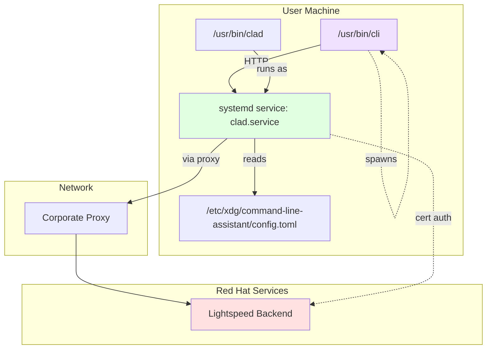

## API Endpoints

### CLAD Endpoints

| Endpoint | Method | Purpose |
|----------|--------|---------|
| `/health` | GET | Health check |
| `/v1/chat/completions` | POST | Chat completions (OpenAI-compatible) |
| `/v1/models` | GET | List available models |

## Error Handling

### Exit Codes (CLI)
- `69` (EX_UNAVAILABLE): Cli binary not found
- `70` (EX_SOFTWARE): Internal software error
- `71` (EX_OSERR): System error
- `73` (EX_CANTCREAT): Can't create output file

### Error Responses (CLAD)
- `502 Bad Gateway`: Backend service unavailable
- `500 Internal Server Error`: Transform/internal error
- `504 Gateway Timeout`: Request timeout

## Testing

### Test Coverage
- Unit tests for all core functions
- Integration tests for API endpoints
- Security tests for argument validation
- Concurrency tests for config file operations

### Key Test Areas
1. **CLI Routing Logic**: Extensive tests for argument parsing
2. **Request Transformation**: OpenAI ↔ Lightspeed format
3. **Security**: Argument validation, null bytes, length limits
4. **Concurrency**: Atomic writes, file locking
5. **Streaming**: SSE event generation

## Future Enhancements

### Planned Features
1. **History Command**: Full implementation with database
2. **Shell Integration**: Bash/Zsh/Fish hooks
3. **Multiple Backends**: Support for additional AI providers
4. **Advanced Caching**: Response caching layer
5. **Telemetry**: Usage metrics and analytics

---

# Code Structure Diagrams

## Workspace and Crate Structure

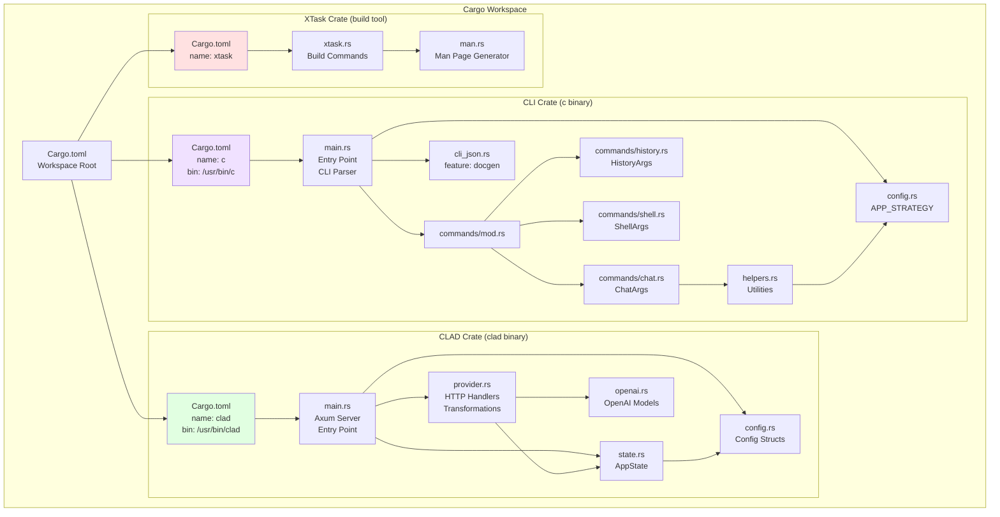

## CLI Crate Module Dependencies

```mermaid
graph LR
    subgraph "External Dependencies"
        CLAP[clap<br/>CLI Parser]
        ETCETERA[etcetera<br/>App Directories]
        FS2[fs2<br/>File Locking]
        LOG[log + env_logger<br/>Logging]
        ANYHOW[anyhow<br/>Error Handling]
        SERDE[serde + serde_json<br/>Serialization]
    end

    subgraph "CLI Module Structure"
        MAIN[main.rs<br/>--<br/>Cli struct<br/>Commands enum<br/>should_route_to_chat]

        CONFIG[config.rs<br/>--<br/>APP_STRATEGY]

        HELPERS[helpers.rs<br/>--<br/>find_cli_binary<br/>validate_args<br/>ensure_cli_config_files<br/>atomic_write<br/>get_filtered_env<br/>is_executable]

        COMMANDS[commands/mod.rs<br/>--<br/>pub mod chat<br/>pub mod history<br/>pub mod shell]

        CHAT[commands/chat.rs<br/>--<br/>ChatArgs struct<br/>execute()<br/>run_cli()]

        HISTORY[commands/history.rs<br/>--<br/>HistoryArgs struct<br/>execute()]

        SHELL[commands/shell.rs<br/>--<br/>ShellArgs struct<br/>execute()]

        DOCGEN[cli_json.rs<br/>feature: docgen<br/>--<br/>dump_cli_json]
    end

    MAIN -->|uses| COMMANDS
    MAIN -->|uses| CLAP
    MAIN -->|uses| LOG
    MAIN -.->|feature: docgen| DOCGEN

    COMMANDS -->|re-exports| CHAT
    COMMANDS -->|re-exports| HISTORY
    COMMANDS -->|re-exports| SHELL

    CHAT -->|uses| HELPERS
    CHAT -->|uses| CLAP
    CHAT -->|uses| LOG

    HELPERS -->|uses| CONFIG
    HELPERS -->|uses| ETCETERA
    HELPERS -->|uses| FS2
    HELPERS -->|uses| ANYHOW
    HELPERS -->|uses| LOG

    CONFIG -->|uses| ETCETERA

    DOCGEN -->|uses| CLAP
    DOCGEN -->|uses| SERDE

    style MAIN fill:#f0e1ff
    style HELPERS fill:#e8d4ff
    style CONFIG fill:#e8d4ff
```

## CLAD Crate Module Dependencies

```mermaid
graph LR
    subgraph "External Dependencies"
        AXUM[axum<br/>Web Framework]
        TOKIO[tokio<br/>Async Runtime]
        REQWEST[reqwest<br/>HTTP Client]
        SERDE_EXT[serde + serde_json<br/>Serialization]
        TOML[toml<br/>Config Parsing]
        TRACING[tracing<br/>Logging]
        UUID[uuid<br/>ID Generation]
        THISERROR[thiserror<br/>Errors]
    end

    subgraph "CLAD Module Structure"
        MAIN_D[main.rs<br/>--<br/>tokio::main<br/>create Router<br/>load Config<br/>bind server]

        PROVIDER[provider.rs<br/>--<br/>chat_completions_handler<br/>models_handler<br/>health_check_handler<br/>create_authenticated_client<br/>transform_request<br/>transform_response<br/>AppError enum]

        OPENAI[openai.rs<br/>--<br/>ChatCompletionRequest<br/>ChatCompletionResponse<br/>Message, Choice, Usage<br/>ChatCompletionChunk<br/>Tool, ToolCall<br/>ModelsResponse, Model]

        CONFIG_D[config.rs<br/>--<br/>Config struct<br/>BackendConfig<br/>AuthConfig<br/>LoggingConfig<br/>from_file()]

        STATE_D[state.rs<br/>--<br/>AppState struct<br/>config: Arc&lt;Config&gt;<br/>client: reqwest::Client]
    end

    MAIN_D -->|uses| PROVIDER
    MAIN_D -->|uses| CONFIG_D
    MAIN_D -->|uses| STATE_D
    MAIN_D -->|uses| AXUM
    MAIN_D -->|uses| TOKIO
    MAIN_D -->|uses| TRACING

    PROVIDER -->|uses| STATE_D
    PROVIDER -->|uses| OPENAI
    PROVIDER -->|uses| CONFIG_D
    PROVIDER -->|uses| AXUM
    PROVIDER -->|uses| REQWEST
    PROVIDER -->|uses| SERDE_EXT
    PROVIDER -->|uses| UUID
    PROVIDER -->|uses| THISERROR

    STATE_D -->|contains| CONFIG_D
    STATE_D -->|contains| REQWEST

    CONFIG_D -->|uses| SERDE_EXT
    CONFIG_D -->|uses| TOML

    OPENAI -->|uses| SERDE_EXT

    style MAIN_D fill:#e1ffe1
    style PROVIDER fill:#d4ffe8
    style OPENAI fill:#d4ffe8
```

## Key Data Structures and Their Relationships

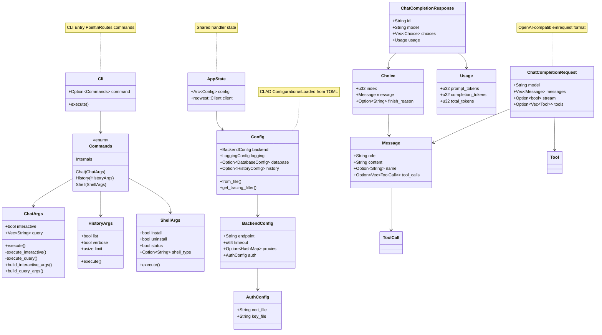

## File Import Graph - CLI Crate

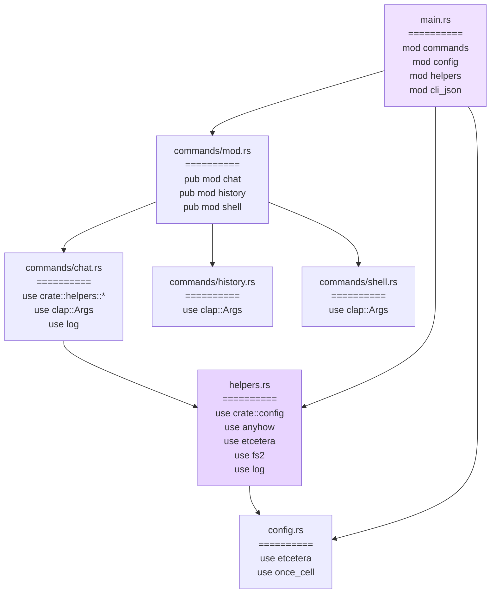

## File Import Graph - CLAD Crate

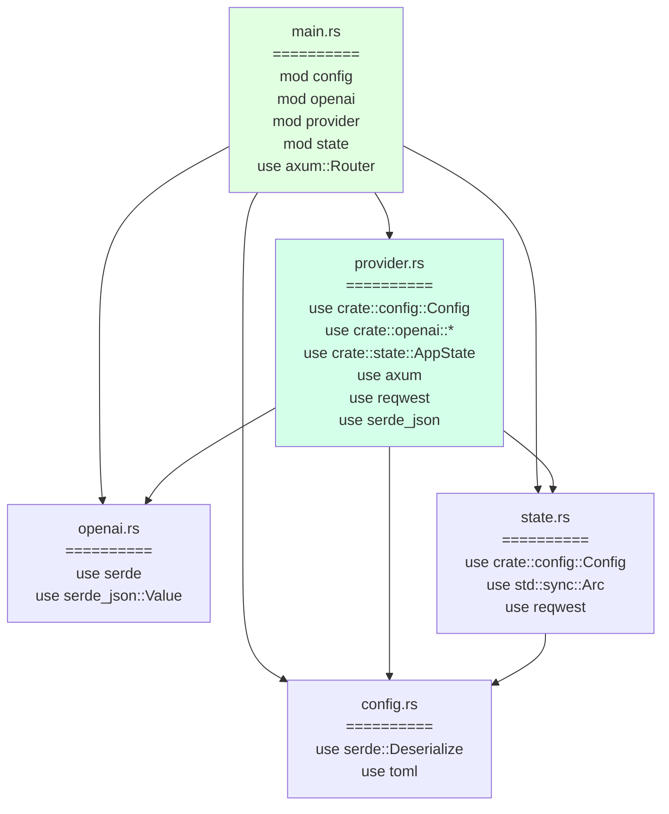

## Function Call Graph - CLI Execution Flow

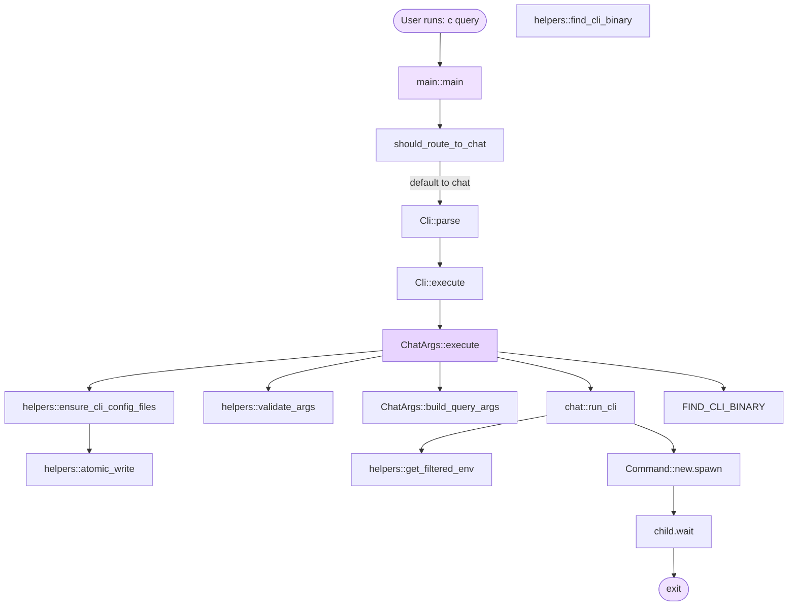

## Function Call Graph - CLAD Request Handling

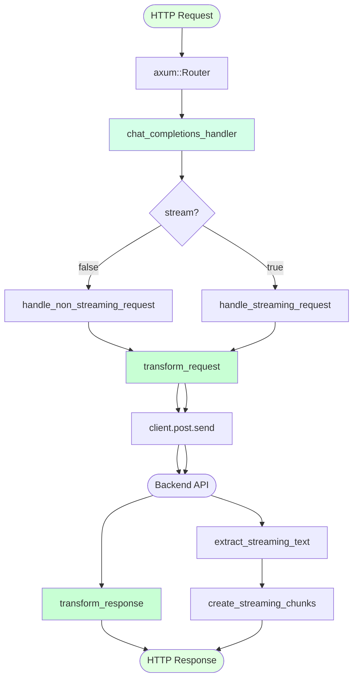

## Testing Structure

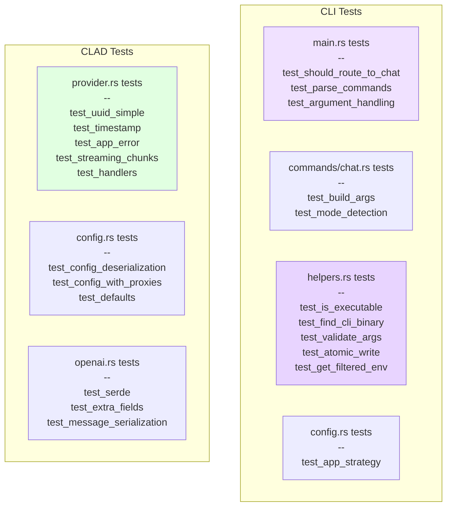

---

**Version**: 1.0.0
**Repository**: https://github.com/r0x0d/cla-rust
**License**: See LICENSE file
